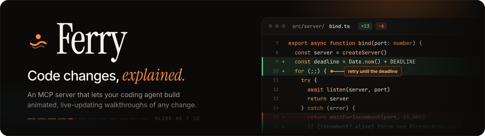

Ferry is an MCP server that lets AI agents build animated, narrated presentations of codebase changes. The presentations open in your browser and update live while the agent builds them.

[](docs/demo.mp4)

▶ **[Watch the full demo](docs/demo.mp4)** (1:50): the agent builds the deck live, walks the behavior, architecture and code, then applies a review comment from the viewer.

Ferry carries reviewers from the old code to the new. It's built on a few ideas that make change explainers easy to follow:

- **Maximum stability.** Code keeps its identity between steps. Only changed lines enter or leave. Lines that only change indentation glide sideways instead of being deleted and re-added.
- **Behavior before code.** Sequence diagrams play the broken behavior, then replay the fix in the same slots. After that, a stepped diff shows the change that causes it.
- **Interruptible motion.** Every channel is a closed-form spring. Retargeting keeps the current position *and* velocity, so pressing ← mid-transition reverses smoothly instead of jumping.
- **Plans, not pixels.** Agents send declarative JSON. The server validates it, resolves git, highlights code with Shiki, and returns actionable warnings.

## Install with your agent

Paste this into Claude Code, Codex, Cursor, or any agent that can run shell commands:

```text
Install the Ferry MCP server for me. Clone https://github.com/danowicz/ferry-mcp into ~/.ferry-mcp (or pull if it's already there), then follow ~/.ferry-mcp/INSTALL.md: check Node ≥ 22.18, run npm install and npm test, and register Ferry with the MCP clients I use. Tell me when it's ready and what I need to restart.
```

[INSTALL.md](INSTALL.md) holds the steps the agent follows: prerequisites, verification, and config snippets for each client.

## Install by hand

```sh
git clone https://github.com/danowicz/ferry-mcp.git ~/.ferry-mcp
cd ~/.ferry-mcp && npm install   # Node ≥ 22.18
```

**Claude Code**

```sh
claude mcp add ferry --scope user -- node ~/.ferry-mcp/bin/ferry.js
```

**Claude Desktop / Cursor / any MCP client** (use the absolute path; clients don't expand `~`)

```json
{
  "mcpServers": {
    "ferry": { "command": "node", "args": ["/Users/you/.ferry-mcp/bin/ferry.js"] }
  }
}
```

Then ask your agent something like:

> Explain the changes on this branch with a Ferry presentation.

The `explain_changes` prompt walks the agent through the whole flow. The viewer starts automatically at <http://localhost:4747> (set `FERRY_PORT` to change it). Decks are stored in `~/.ferry/decks` (set `FERRY_HOME` to change it).

## Tools

| Tool | What it does |
| --- | --- |
| `authoring_guide` | Slide types, JSON shapes, storytelling rules |
| `inspect_changes` | Changed files, churn, and numbered *changes* (blocks of added, removed, or re-indented lines) |
| `create_deck` / `update_deck` | Deck metadata and theme |
| `add_slides` / `update_slide` / `remove_slides` / `reorder_slides` | Edit the deck; warnings flag unmatched callouts, unknown ids, folded targets |
| `get_deck` / `list_decks` | Read back authoring JSON and outlines |
| `delete_deck` | Deletes a deck with its change plan and chat |
| `draft_deck_from_git` | Skeleton deck: title with stats, file map, one stepped diff per significant file |
| `open_deck` | Opens the live viewer |
| `wait_for_feedback` | Waits until you send a plan from the viewer, then returns it to implement (outline and slide JSON) |
| `get_feedback` | Returns what's pending without waiting |
| `resolve_feedback` | Closes a sent plan with a reply shown in the viewer |
| `reply_feedback` | Asks you a question in the viewer |
| `export_deck` | One self-contained HTML file (fonts and code inlined, works offline) |

## Review, plan, then implement

Ferry splits a review into three steps, all in the viewer:

1. **Review** the change through the deck the agent built: behavior, architecture, then the code, step by step.
2. **Plan** what should change next. Press **C** and switch the chat to **Plan** (or press Shift+Tab). Describe a change ("make the retry interval configurable", "add a test for the live-server guard") and **Pin** the code line it's about if you like. Claude reads the code and drafts the change as a **plan deck**: a second set of slides with the proposed code as hand-written diffs, the approach, and the tests to add. **Nothing in the repository changes while you plan.** Open the plan with the **Plan** button in the bar, keep chatting to revise it, and go back and forth until the slides say what you want.
3. **Implement**: in the panel's **Plan** tab, press **Send plan to agent**.
   - If *your* agent (the one that built the deck) is waiting in `wait_for_feedback`, the panel says **Agent is listening** and the agent receives the plan: its outline and every slide's authoring JSON.
   - Otherwise Claude Code running in the viewer implements it. It edits the code in the deck's repository on the checked-out branch, never commits, and you follow along in the Chat tab. If it doesn't finish, the plan goes back so you can send it again.
   - The agent replies when it's done (**Done** or **Declined**). Reply under it to reopen. Review the result with `git diff` as usual.

**Copy as prompt** gives you a prompt for any other agent to implement the plan.

### The chat

The chat is a conversation with a Claude Code agent dedicated to the deck. It runs headless (`claude -p`) in the deck's repository, using your existing Claude Code login.

- Every message carries what you're looking at: the slide, the step, and anything you **Pin** (a code line, node, row…).
- **Ask** mode answers questions and can edit the deck you're reviewing. **Plan** mode edits only the plan deck. Neither can touch repository files: only a sent plan does, and each mode can only write to its own deck.
- Replies stream into the panel along with what the agent is doing ("Reading bind.ts", "Adding slides"), and slides update live.
- The conversation continues across messages. **New chat** starts over, and **Stop** interrupts.

Set `FERRY_CHAT_MODEL` to pick a model (e.g. `sonnet` for faster replies), or `FERRY_CLAUDE_BIN` if `claude` isn't on your PATH. Chat logs are stored in `~/.ferry/chat/` and sent plans in `~/.ferry/feedback/`. The viewer only accepts JSON requests from localhost pages, so other websites can't send instructions to your agent.

## Slide types

`title` · `section` · `points` (cards, list, checklist) · `files` · **`diff`** (from git, before/after, hand-written lines, or plain code; with steps, focus, callouts, morph or review mode) · `sequence` (before/after phases) · `flow` (architecture with status changes and travelling packets) · `metrics` (rolling numbers) · `compare` (code, points, markdown, or a draggable image wipe for UI changes) · `markdown`.

## Viewer keys

→ / Space: next step · ← back · ↑ ↓ slides · **C** chat & plan · **P** pin · **O** overview · **N** speaker notes · **V** voice narration (auto-advances) · **T** theme (midnight, tokyo, evergreen, paper) · **S** slow motion · **R** replay · **F** fullscreen · **?** help

## CLI

```sh
node bin/ferry.js serve [--open]        # standalone viewer
node bin/ferry.js list                  # saved decks
node bin/ferry.js delete <deck-id>…     # delete decks (or use the trash button on the home page)
node bin/ferry.js export <deck-id> [out.html]
npm run demo                            # builds the showcase deck through MCP
npm run record                          # re-records docs/demo.mp4 (needs ffmpeg and Playwright's Chromium)
npm run banner                          # re-renders docs/banner.png
npm test                                # end-to-end check of every tool
```

## Layout

```text
src/           MCP server (Node runs TypeScript directly)
  mcp.ts         tools, prompt, resource
  schema.ts      authoring input (zod) — what agents send
  compile.ts     authoring → render model: ids, git, highlighting, steps, warnings
  diff.ts        line diff with re-indent detection, change blocks, folding
  model.ts       render model shared with the viewer
  server.ts      viewer HTTP server + live updates (SSE) + feedback API
  feedback.ts    change requests, agent presence, change-plan formatting
  chat.ts        viewer chat: headless Claude Code per deck, streamed over SSE
viewer/src/    presentation app (bundled with esbuild on demand)
  motion.ts      closed-form interruptible springs
  feedback.ts    side panel: chat tab, change-plan tab, pinning
  markdown.ts    safe Markdown for chat replies
  slides/        one view per slide type
scripts/       demo, smoke test, screenshot walker, demo-video recorder, banner
docs/          banner, demo video and GIF
```
